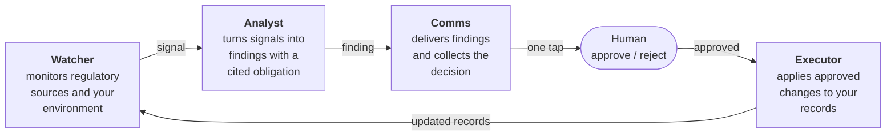

# Kindlast

**The compliance team for EU companies that don't have one.**

[](./LICENSE)
[](https://github.com/Entear-OU/kindlast/actions/workflows/ci.yml)

Kindlast is an AI-native compliance workspace for GDPR and the EU AI Act. It runs
continuously on behalf of an organisation: monitoring its regulatory
environment, detecting compliance gaps as they emerge, proposing specific
remediation, and escalating to a human only when a real decision is needed.

It is deliberately not a dashboard you log into and work through. It is a set of
agents that work in the background and surface findings through the channels you
already use.

## The problem

An EU SME with 30 people and a few AI features in production is subject to the
same GDPR obligations as an enterprise, and now the AI Act on top. They cannot
justify a full-time DPO, so compliance becomes a consultant's PDF that ages
badly, or a spreadsheet nobody updates, or nothing at all until something goes
wrong.

The gap is not knowledge. It is that compliance is continuous and nobody has the
hours.

## How it works

Four agents, each with a deliberately narrow remit. The separation matters: the
agent that decides something is wrong is not the agent that changes your
records, and neither of them can email your team.



**Watcher** monitors EDPB opinions, AI Act implementing acts, national DPA
guidance and EUR-Lex, plus your own environment for compliance-relevant change.
It decides when something is worth analysing.

**Analyst** turns a signal into a finding: what was detected, which obligation it
maps to with an article citation, a severity, and a specific proposed action.
"Draft a Data Processing Agreement with Vendor X", not "review your vendor
agreements". It analyses and proposes. It never acts.

**Comms** delivers the finding and collects a decision. Every message is the same
shape: what happened, why it matters, what to do, and a single tap to approve,
reject, or defer.

**Executor** applies approved changes to your compliance records, and only
approved ones. Nothing reaches your ROPA without a human having said yes.

Findings cite the regulation, and citations resolve to verbatim source text
fetched at read time, so you can always check the claim against the law rather
than trusting a summary.

## Status

Kindlast is in active development. Being straight about what exists:

| Area | State |
|---|---|
| Conversational onboarding and compliance profile | Built |
| Analyst findings, narrative generation, citations | Built |
| Records: ROPA, AI systems register, DSAR log | Built |
| Comms over email, including one-tap approve and reject | Built |
| Weekly briefing and deadline alerts | Built |
| Regulatory corpus: GDPR, AI Act, EDPB, enforcement decisions | Built |
| Billing | Built |
| Watcher: continuous regulatory monitoring | Partial |
| Executor: automated record updates | Partial |
| Comms over WhatsApp and Slack | Planned |

Expect breaking changes. If you are evaluating this for production use, talk to
us first.

Where this is heading next is in the [roadmap](./docs/ROADMAP.md).

## Tech stack

| Layer | Technology |
|-------|-----------|
| Framework | Next.js 16 (App Router) |
| UI | shadcn/ui + Tailwind CSS v4 |
| API | Go, Connect RPC, protobuf contract |
| Database | Postgres with pgvector, forced row level security |
| Identity | OIDC (Zitadel in the bundled stack), authorization code with PKCE |
| AI | Vercel AI SDK |
| Validation | Zod |
| Testing | Vitest, React Testing Library, Playwright, Go `testing` |

## Quickstart

### Prerequisites

- [Bun](https://bun.sh) 1.3+
- Node.js 22.13+ (Bun installs and runs scripts; Next.js and Vitest run on Node)
- Docker, for the local stack

### Running locally

```bash
git clone https://github.com/Entear-OU/kindlast.git
cd kindlast
bun install

docker compose -f deploy/compose.yaml up -d   # Postgres, Zitadel, Redis, core-api, edge
./scripts/web-env.sh                          # writes apps/web/.env.local from the stack

bun run dev
```

The app runs at <http://localhost:3000>, the authorization server at
<http://localhost:8300>, and core-api through the edge at
<http://localhost:8000>.

Do not write `apps/web/.env.local` by hand. The OAuth client is generated per
environment into a docker volume, so `web-env.sh` is the only path to it, and
it has to be re-run after `docker compose down -v` discards that volume.

`.env.example` documents every variable and what it unlocks. `EMAIL_PROVIDER`
defaults to `console`, so local development needs no email credentials.

### Development commands

```bash
bun run dev              # dev server
bun run build            # production build
bun run lint             # ESLint
bun run typecheck        # typecheck
bun run test             # everything
bun run test:unit        # unit and component tests
bun run test:e2e         # the sign-in round trip, needs the compose stack
bun run test:db          # tenant isolation, needs the compose stack
bun run test:coverage    # with coverage
```

## Self-hosting

You can run your own instance. See [docs/self-hosting.md](./docs/self-hosting.md).

One thing worth knowing before you start: the background agents run on scheduled
HTTP calls, not an in-process timer. Off Vercel you have to schedule them
yourself, and if you do not, the app looks perfectly healthy while doing
absolutely nothing. The guide covers it.

## Database

All schema changes flow through versioned goose migrations in `db/migrations/`,
applied by a job container that must exit zero before the stack is considered
up. Never apply DDL by hand.

```bash
docker compose -f deploy/compose.yaml up -d   # applies every migration
bun run test:db                               # asserts tenant isolation holds
```

Tenancy is not a filter, it is a security boundary. Every table in `public` has
row level security **enabled and forced**, the application connects as a role
that owns nothing and cannot bypass it, and `bun run test:db` checks those
properties over `pg_class` rather than trusting convention. Read the row level
security section of [AGENTS.md](./AGENTS.md) before adding a table.

## Project structure

```
apps/web/app/
├── (public)/           # Landing, login
├── (authed)/           # Console: dashboard, feed, records, settings, billing
│   ├── onboarding/     # Conversational profile building
│   ├── feed/           # Findings and detail views
│   └── records/        # ROPA, AI systems, DSAR
└── api/                # Route handlers, including scheduled agent endpoints

apps/web/lib/
├── auth/               # OIDC client, PKCE, Redis sessions, the core-api client
├── email/              # Swappable email provider seam
└── websearch/          # URL-fetch provider seam. No caller today (ENT-240)

data/corpus/            # GDPR, AI Act, EDPB and enforcement source data
db/migrations/          # Squashed baseline for the self-managed stack (goose)
db/tests/               # Database isolation suite (RLS security boundary)
deploy/                 # compose.yaml, Postgres role split, Zitadel, Caddy
docs/                   # Self-hosting, maintainer workflow, brand
```

### The local backend stack

The self-managed stack (Postgres with the tenancy role split, Zitadel as the
OIDC provider, Redis, Caddy) comes up with one command and seeds itself:

```bash
docker compose -f deploy/compose.yaml up -d
bun run test:db   # the database isolation suite, against that stack
```

## Testing

The project follows test-driven development, and it is not decorative. Failing
test first, minimum implementation, then refactor green.

Note that the database suite self-skips when the local stack is unreachable, so
a green `bun run test` locally does not necessarily mean it ran. CI boots the
stack and fails loudly if it is missing.

The compliance console (dashboard, feed, records, settings, billing) is being
rebuilt. It was removed with Supabase, because its tenancy was Supabase's
`auth.uid()` row level security and authentication no longer produces a
Supabase session. What exists today is the marketing site, the sign-in flow and
an organisation's own page at `/o/{slug}/`; the rest returns surface by surface
on `core-api`.

## Working with LLMs in this repository

Kindlast is an AI-native product: agents draft, classify and act, and the
harness around them is most of the engineering. Every contributor, and every
coding agent working in this repository, builds against the
[OWASP Top 10 for LLM Applications (2026)](https://github.com/GenAI-Security-Project/GenAI-LLM-Top10).
The list below says what each entry means here and where the control lives.
The short version: **the model may ask; only code refuses.** Authority lives in
the scope interceptor, row level security and database constraints, never in a
prompt.

| Entry | What it means in this repository |
|---|---|
| **LLM01 Prompt injection** | Anything retrieved, fetched from a customer's tools, or typed by a user is data, never instruction. Label it, do not append it to a system prompt. Injection cases belong in the eval set. |
| **LLM02 Sensitive information disclosure** | Traces are redacted at the SDK and stay in the EU. Nothing per-organisation goes before the prompt cache breakpoint. Memory is off unless a design decision turns it on, and then it is org-scoped and deletable. |
| **LLM03 Excessive agency** | An agent's only tools are `core-api` RPCs: scope-checked, RLS-bound, audited. No filesystem writes, no shell, no database handle. Approvals are rows a human writes; the model never approves anything. |
| **LLM04 Supply chain** | Pin every model, provider, framework and skill version. Skills ship in the image; nothing is fetched at runtime. Customer MCP servers reach only the workers gateway behind an egress allow-list. |
| **LLM05 Data and model poisoning** | The regulatory corpus in `data/corpus/` is reviewed data, not crawled data. Anything external enters through review before ingestion. |
| **LLM06 Unbounded consumption** | Every run has a token budget, a model-call limit, a tool-call limit and a recursion limit. Usage is attributed per organisation with cached tokens counted separately. |
| **LLM07 Misinformation** | A citation must resolve to a stored obligation or it is refused. A finding citing the wrong article is worse than no finding. Never let the model state a deadline it did not read from a row. |
| **LLM08 Hidden context exposure** | No credential, secret or authorisation rule lives in a prompt. If a system prompt leaked in full, it must be embarrassing, not exploitable. |
| **LLM09 Vector and embedding weaknesses** | The corpus embeddings are shared and read-only to the Python service. Any per-organisation embedding lives under RLS like every other org table. |
| **LLM10 Improper output handling** | Model output is untrusted data. Validate it against a typed schema before it reaches `IngestService`; render it as text, never as markup or links the model built. |

Two more rules that follow from these:

- **Every agent run leaves a record a customer can read**: what it was asked,
  which skill and model, every tool call, every citation resolved or rejected,
  cost and outcome. That record is part of the product; the trace is for
  engineers.
- **Third-party data enters through the gateway or not at all.** Read-only by
  default, labelled, redacted before storage, provenance stamped. The Python
  service never holds a customer's credential.

If you find a way around any of these, that is a vulnerability. Report it
through the [security policy](./SECURITY.md), not in a public issue.

## Contributing

Contributions are welcome. Start with [CONTRIBUTING.md](./CONTRIBUTING.md),
which covers setup, the testing expectation, and what makes a pull request easy
to review.

Please open an issue before starting anything substantial, so you do not spend a
weekend on something that does not fit the direction.

By contributing you accept the [CLA](./CLA.md). It grants a licence, it does not
assign copyright: you keep full ownership of your work.

- [Code of Conduct](./CODE_OF_CONDUCT.md)
- [Security policy](./SECURITY.md). Never report vulnerabilities in public issues.

## License

Copyright (C) 2026 Entear OÜ.

Kindlast is free software, licensed under the
[GNU Affero General Public License v3.0](./LICENSE) (AGPL-3.0-only). You may
use, study, modify, and redistribute it under those terms.

The AGPL is a copyleft licence with one addition that matters for a hosted
product: if you run a modified version of Kindlast as a network service, section
13 requires you to offer your users the corresponding source of your
modifications. Running an unmodified copy, or using Kindlast internally without
offering it to others over a network, carries no such obligation.

The licence covers the code **and** the regulatory corpus in `data/corpus/`. The
corpus holds original summaries written for Kindlast rather than reproductions
of the underlying legal texts, so it is ours to license. See
[data/corpus/README.md](./data/corpus/README.md) for per-file provenance and the
accuracy disclaimer.

One thing is scoped separately:

- **Trademarks.** The Kindlast name and the logo assets in `docs/brand/` are not
  covered by the AGPL grant. You may not use them to imply endorsement by, or
  affiliation with, Entear OÜ.

---

Kindlast summarises regulation to help you navigate it. It is not legal advice.
